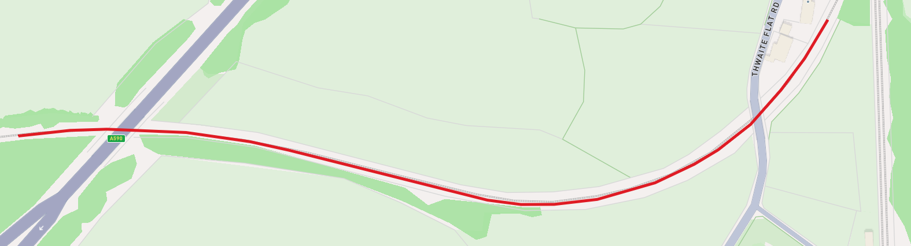

# GeoFurlong Python API

## Introduction

A Python API library to interact with the GeoFurlong production database offering facilities to compute the position of a point or section of track on Network Rail railway lines in Britain. The position can be returned using Ordnance Survey (Easting / Northing) or geographic (Latitude / Longitude) systems, defined by [Engineer's Line Reference](https://en.wikipedia.org/wiki/Engineer%27s_Line_Reference) (ELR) and mileage.

See the [GitHub](https://www.github.com/geofurlong/) repository on how the underlying production database is built, and the [GeoFurlong web site](https://www.geofurlong.com/) for comprehensive tabular and mapping outputs using the database.

## Quick Start

1. Install [Python]((https://www.python.org/)). The library has been developed in environments using Python versions 3.11 and 3.12.
2. Install the required Python support libraries `numpy`, `shapely`, and `pyproj`, as defined in the `requirements.txt` file, preferrably into a [virtual environment](https://docs.python.org/3/library/venv.html).
3. Download `geofurlong.sqlite` from [Dropbox](https://www.dropbox.com/scl/fo/1tzbnx4zaz61nwslqobn9/AOcmAULa79IuAjLNIvZThRQ?rlkey=fx8e3gxwhtgmlq2v0akv827ty&dl=0).
4. Copy `geofurlong.py` and `geofurlong.sqlite` into a common directory, then run a Python script from this directory to interact with the library.

```python
from geofurlong import Geofurlong

gf = Geofurlong()
print("GeoFurlong Python API version", gf.api_version)
# GeoFurlong Python API version 0.1.0

print("GeoFurlong database version  ", gf.db_version)
# GeoFurlong database version   6.8.1
```

This example assumes `geofurlong.py` is in the same directory as this script. If this is not the case, specify the path to the module file or modify the Python search path. Similarly, the default constructor for `Geofurlong` assumes `geofurlong.sqlite` is in the same directory as the running script. If this is not the case, specify the path to the database file, e.g. `gf = Geofurlong('path/to/geofurlong.sqlite')`.

## Point on an ELR at a mileage

To establish the position of the railway on an  at a specific mileage on an ELR, use the `at` method. This method takes an `elr` and `total_yards` values as parameters. If the mileage is formed of miles and yards, multiply the miles component by 1760 (or the helper `Geofurlong.YARDS_IN_MILE` constant) or use the helper `gf.build_total_yards` (or its identical shorter equivalent `gf.ty`) to create the total yards value.

The `at` method takes an optional boolean parameter `lon_lat` which defaults to `False`, meaning that the position is returned as point based on the Ordnance Survey Easting / Northing planar system, in metres. If the `lon_lat` parameter is set to `True`, the geographic position is returned as Longitude / Latitude, in decimal degrees.

The `at` method returns a Shapely [Point](https://shapely.readthedocs.io/en/stable/reference/shapely.Point.html#shapely.Point) type. For planar co-ordinates, the `Point`'s `x` and `y` properties represent the Easting and Northing value respectively. For geographic co-ordinates, the `x` and `y` values represent the Longitude and Latitude values respectively.

The example below shows the co-ordinates at Taunton station on ELR MLN1 at mileage 163 miles 264 yards.

```python
from geofurlong import Geofurlong

gf = Geofurlong()

# Position as Ordnance Survey Grid Easting / Northing references (metres)
taunton = gf.at("MLN1", 163 * 1760 + 264, lon_lat=False)
taunton.x  # 322720.5142244608
taunton.y  # 125465.02836554064

# Position as Longitude / Latitude (decimal degrees)
taunton = gf.at("MLN1", gf.ty(163, 264), lon_lat=True)
taunton.x, taunton.y  # (-3.103234160294033, 51.02334128880169)
```


## Points along an ELR between mileages

The `between` method returns a Shapely [LineString](https://shapely.readthedocs.io/en/stable/reference/shapely.LineString.html#shapely.LineString) for a given mileage range on an ELR. As per the `at` method, the mileages are specified as a total yardage integer.

The example below shows the geographic co-ordinates around Crawley station on ELR TBH1 between mileages 30 miles 900 yards and 30 miles 1300 yards.

```python

from geofurlong import Geofurlong

gf = Geofurlong()

crawley = gf.between("TBH1", gf.ty(30, 900), gf.ty(30, 1300), lon_lat=True)
list(crawley.coords)
# [(-0.1844110110853184, 51.111886920235946),
#  (-0.18449916975964414, 51.111891178953535),
#  (-0.18522434170011604, 51.111926206592656),
#  (-0.18615943937059476, 51.11199523106564),
#  (-0.18710841735754202, 51.11208927588358),
#  (-0.18802252801591818, 51.11220129101981),
#  (-0.18953425824079795, 51.11242664492291)]
```


The `at` and `between` methods co-ordinates can be converted to [GeoJSON](https://en.wikipedia.org/wiki/GeoJSON) format for interfacing with external systems and libraries. The `to_geojson(dalton)` output string below was pasted directly into the [geojson.io](https://geojson.io/) website to visualise a section of the Cumbrian Coast line (ELR CBC1) between 32 miles 880 yards and 32 miles 1540 yards, near Dalton-in-Furness.

```python
from geofurlong import Geofurlong
from shapely import to_geojson

gf = Geofurlong()
to_geojson(gf.between("CBC1", gf.ty(32, 880), gf.ty(32, 1540), lon_lat=True))
# '{"type":"LineString","coordinates":[[-3.2099777665038487,54.15754751988057],[-3.2094386435911892,54.15758171130264],[-3.2090576822775625,54.157588679341096],
# [-3.208235642540509,54.157568624705405],[-3.2075725989548993,54.15751263087136],[-3.207168630378327,54.15746068870881],[-3.205112634928681,54.15715762779291],
# [-3.204762695623599,54.15713065554436],[-3.2044206105146293,54.15713165356737],[-3.2039726277292853,54.15716166075737],[-3.2033726443450523,54.157262666904735],
# [-3.2029665816857684,54.15737566385775],[-3.2027225145068736,54.157461592367305],[-3.202383549091284,54.157617599712154],[-3.2020665038673184,54.157827666845535],
# [-3.201822571423683,54.15801858407085],[-3.2015821681975916,54.158254185584816]]}'
```



## Regular points along an ELR

To establish regular points along an ELR at a defined interval (in yards), use the `traverse` method. This takes an `elr` and `interval` as parameters and returns a Python [iterator](https://wiki.python.org/moin/Iterator). This iterator provides a `total_yards` value at the requested interval (plus the ELR's start and end points) to allow further usage, normally to compute the co-ordinates.

The example below shows the `traverse` method being applied to ELR SUB2 (Edinburgh South Suburban Line) to provide the longitude / latitude geographic co-ordinates at 880 yard intervals.

```python
from geofurlong import Geofurlong
from shapely.geometry import MultiPoint
from shapely import to_geojson

gf = Geofurlong()

sub = "SUB2"
points = []
for ty in gf.traverse(sub, 880):
    geo = gf.at(sub, ty, lon_lat=True)
    points.append((geo.x, geo.y))

sub_points = MultiPoint(points)

to_geojson(sub_points)
# {"type":"MultiPoint","coordinates":[[-3.231130244249457,55.942663901441],[-3.23707458153932,55.93770428738547],[-3.233413731481704,55.931142495521975],
# [-3.224566737290968,55.92601332313402],[-3.2120292126821806,55.925827657493635],[-3.1996045772495845,55.92617587220134],[-3.186898004478742,55.92713976135173],
# [-3.175590898223584,55.9302261124498],[-3.1641054427581112,55.929919310206344],[-3.1521729474755995,55.9295091695051],[-3.1434059132044703,55.93456135332027],
# [-3.131389531821325,55.936252214974196],[-3.1187739145261237,55.936880544091046],[-3.10565283167397,55.93736302935286],[-3.10047257043542,55.94075120424232]]}
```


## Mapping

The library does not include any facility to generate *maps*, as there are many powerful solutions available to Python users, e.g. [Folium](https://python-visualization.github.io/folium/latest/).

Using the `Folium` library, background mapping can be displayed in an interactive map or saved as a standalone HTML file. The examples below shows a section of track on ELR RBS2 between 12 miles 600 yards and 12 miles 1350 yards, south-east of Wolverhampton station.

```python
from geofurlong import Geofurlong
import folium

gf = Geofurlong()

wolverhampton = gf.between("RBS2", gf.ty(12, 600), gf.ty(12, 1350), lon_lat=True)

# Folium requires the co-ordinates to be in the format (latitude, longitude).
coordinates = [(y, x) for x, y in wolverhampton.coords]

# Create map with standard background tiles.
standard_map = folium.Map()
folium.PolyLine(coordinates).add_to(standard_map)
standard_map.fit_bounds(standard_map.get_bounds())
standard_map.save("wolverhampton_standard.html")

# Create map with satellite background tiles.
satellite_map = folium.Map()
folium.TileLayer(
    tiles="https://server.arcgisonline.com/ArcGIS/rest/services/World_Imagery/MapServer/tile/{z}/{y}/{x}",
    attr="Esri",
    name="Satellite",
    overlay=False,
    control=True,
).add_to(satellite_map)
folium.PolyLine(coordinates).add_to(satellite_map)
satellite_map.fit_bounds(satellite_map.get_bounds())
satellite_map.save("wolverhampton_satellite.html")
```

Standard map background


Satellite map background


### Attribute Methods

A number of helper methods and properties are available within the library which are not directly related to computation of positional co-ordinates. These are included as standalone example scripts in this repository, with some examples shown below. Some of the example scripts require the installation of additional libraries, e.g. `geopandas` and `folium`.

```python
from geofurlong import Geofurlong

gf = Geofurlong()
ltn1 = gf.elr("LTN1")

print(f"ELR:              {ltn1.elr}")
print(f"Route:            {ltn1.route}")
print(f"Section:          {ltn1.section}")
print(f"Remarks:          {ltn1.remarks}")
print(f"Metric:           {ltn1.metric}")
print(f"Reported Start:   {ltn1.ty_from} (express as total yards)")
print(f"Reported End:     {ltn1.ty_to} (express as total yards)")
print(f"Reported Extents: {ltn1.formatted_range}")
print(f"Reported Length:  {ltn1.reported_len_y} yards")
print(f"Reported Length:  {ltn1.reported_len_km:.3f} km")
print(f"Measured Length:  {ltn1.measured_len_km:.3f} km")
print(f"Grouping:         {ltn1.grouping}")
print(f"Neighbours:       {ltn1.neighbours}")
print(f"TRACKmap book(s): {ltn1.trackmaps}")
```

Outputs:

```bash
ELR:              LTN1
Route:            Great Eastern Main Line (GEML)
Section:          London Liverpool Street to Trowse Lower Jn
Remarks:          
Metric:           False
Reported Start:   -67 (express as total yards)
Reported End:     200412 (express as total yards)
Reported Extents: 0M -067y - 113M 1532y
Reported Length:  200479 yards
Reported Length:  183.318 km
Measured Length:  183.560 km
Grouping:         ['LTN1', 'LTN2']
Neighbours:       ['BDM', 'BFC', 'BGK', 'BRA', 'CCH', 'CDY', 'CNS', 'COC', 'CST', 'DWW2', 'ELL1', 'ESK', 'ETN', 'FGW', 'GFB', 'GRW', 'IPD', 'IUP', 'LTN2', 'LVS', 'MAH', 'NTE', 'ROU', 'SDC', 'SSV', 'SUD', 'TAH2', 'TFC', 'TRL2', 'XRC', 'XRE']
TRACKmap book(s): [('2', 'Eastern'), ('3', 'Western & Wales'), ('5', 'Southern & TfL')]
```

### Accuracy

The computed geographic position for a defined ELR and mileage may not be accurate in all instances. In a number of locations, the position may be incorrect by a significant linear distance, particularly on closed or partially-closed lines. Refer to the `remarks` property of an ELR which may indicate a risk of poor accuracy, as shown in the examples below.

It should be noted that the computed positional co-ordinates are based on the notional centre-line of the ELR.

Given these credible risks to positional accuracy, this library must not be used for safety-critical decisions, nor relied upon as the primary geographic data source in production environments.

```python
from geofurlong import Geofurlong
gf = Geofurlong()

bml2 = gf.elr("BML2")

bml2.reported_len_km
93.6875952

bml2.measured_len_km
93.6150669947

bml2.remarks
'Short mile noted in records'


gf.elr("EGM1").remarks
'Known anomalies with data source accuracy'
```

### To Do

- Include linear accuracy reporting for `at` and `between` methods.
- Add facility for `traverse` method to accept an interval in metres for metric ELRs.

### Performance

This library can compute the co-ordinates of railway points at many thousand iterations per second. It utilises robust high-performance libraries which are written in C, thus the normal performance overheads associated with the dynamic typing nature of Python are reduced. Some basic performance benchmarks are recorded in this [example](lib/example_98_performance.py).

For higher-performing geocoding requirements, see the [GeoFurlong builder](https://github.com/geofurlong/builder) repository on GitHub which is written in Go.

### Testing

A set of unit [tests](lib/test_geofurlong.py) are included in this repository which require the installation of `pytest` to run - see [requirements-dev](lib/requirements-dev.txt).

### Credits

GeoFurlong is built upon a framework of open-source software applications and libraries, utilising portions of geospatial datasets which have been released under permissive licences.

- [Network Rail](https://www.networkrail.co.uk/) geospatial datasets - [download](https://files.whatdotheyknow.com/request/update_geospatial_data/FOI202400062/).
- [SQLite](https://sqlite.org/) database engine library.
- [numpy](https://numpy.org/) scientific computing library.
- [Python](https://www.python.org/) programming language.
- [Shapely](https://shapely.readthedocs.io/en/stable/index.html) planar geometry library (which utilises the [GEOS](https://libgeos.org/) library).
- [pyproj](https://pyproj4.github.io/pyproj/stable/) cartographic projections and coordinate transformations library.

### Disclaimer

The output data is provided as is, with no warranty of any kind, express or implied. In no event shall the GeoFurlong author be liable for any claim, damages or other liability, whether in an action of contract, tort or otherwise, arising from, out of or in connection with this repository or data output.

### Licence

The library source code and database are released under the permissive [MIT Licence](https://opensource.org/licenses/MIT) with a view to benefitting those working in the railway environment and foster further innovation.

### Author

Alan Morrison *CEng MICE Eur Ing FPWI*
